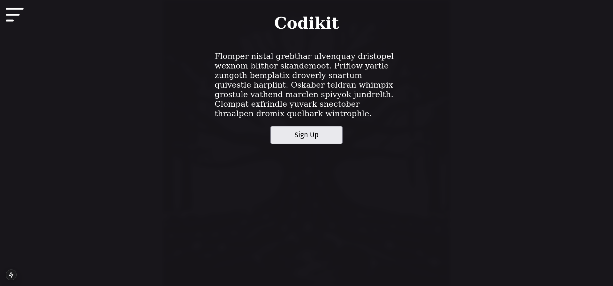

# CoRyte

## Collaborative Storytelling app

## ToDo
### Editor
- Toolbar:
    - Code Snippet language selection
- Authentication only page
- POST request for story logs to DB

### Deployment
- CICD

### Backend
- RDS Cloud backend migration
- SQLite local db for React Native version
- SQLite to RDS connection flow

## Done
- ~~Postgres Local~~
- ~~Markdown Mode~~
- ~~Click-to-Home on every page~~ 
